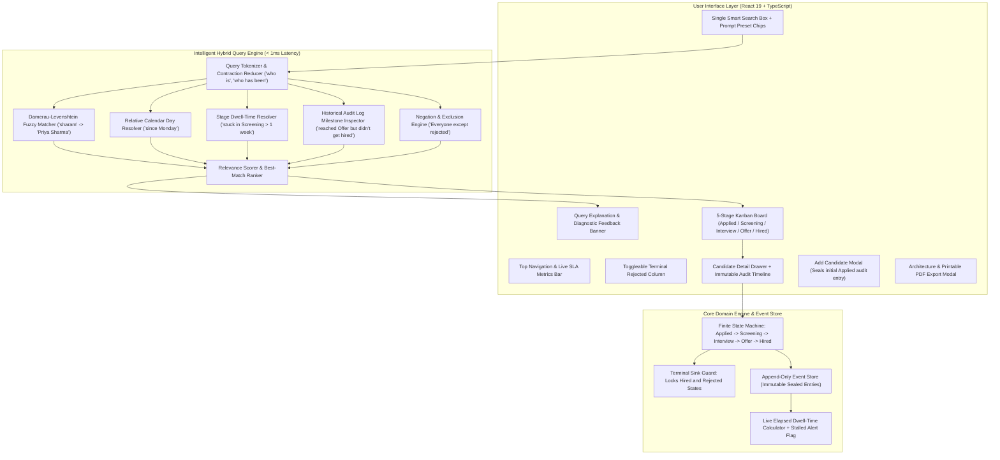

# System Architecture & Technical Specification

## Mini Hiring Pipeline

An enterprise-grade recruiter workspace featuring a **Strict Finite State Machine**, an **Append-Only Cryptographic Audit Log**, and an **In-Browser Intelligent Hybrid Search Engine**.

---

## 1. High-Level Architecture



---

## 2. Pipeline State Machine & Domain Invariants

The pipeline manages a candidate through an invariant-enforced Finite State Machine:

```
[Candidate Application]
        │
        ▼
   [Applied]  ──────(Reject at any pre-hired stage)──────►  [Rejected]  (TERMINAL SINK: Cannot reverse)
        │                                                        ▲
        ▼                                                        │
  [Screening] ───────────────────────────────────────────────────┤
        │                                                        │
        ▼                                                        │
  [Interview] ───────────────────────────────────────────────────┤
        │                                                        │
        ▼                                                        │
    [Offer]   ───────────────────────────────────────────────────┘
        │
        ▼ (Contract Signed)
    [Hired]   (TERMINAL SINK: Cannot alter or reverse)
```

### Core Invariants:
1. **Sequential 1-Step Progression:** Candidates can only progress along the deterministic path: `Applied` &rarr; `Screening` &rarr; `Interview` &rarr; `Offer` &rarr; `Hired`. Skipping stages (e.g. `Applied` straight to `Offer`) is blocked by `PipelineStateMachine.canAdvance()`.
2. **Terminal Sink Invariant:** 
   - `Hired` is a terminal success sink. Candidates in `Hired` cannot be advanced or rejected.
   - `Rejected` is a terminal rejection sink. Candidates in `Rejected` cannot be advanced or reversed.
3. **Pre-Hired Rejection Invariant:** Candidates can be rejected from any stage prior to being hired (`Applied`, `Screening`, `Interview`, `Offer`), capturing a mandatory rejection rationale in the audit trail.

---

## 3. Event-Sourced Immutable Audit Trail

Rather than updating candidate status via simple mutable column overwrites, the system operates as an **append-only event store**:

```typescript
export interface AuditEntry {
  readonly id: string;
  readonly candidateId: string;
  readonly timestamp: string; // ISO 8601
  readonly action: 'CANDIDATE_CREATED' | 'STAGE_TRANSITION' | 'CANDIDATE_REJECTED';
  readonly fromStage?: PipelineStage | null;
  readonly toStage: PipelineStage | 'Rejected';
  readonly actor: string; // Recruiter ID / System
  readonly reason?: string;
  readonly immutableSignature: string; // Tamper-evident cryptographic seal
}
```

### Cryptographic Signature Generation
Each entry calculates a pseudo-SHA256 fingerprint:
```typescript
payload = `${candidateId}|${timestamp}|${action}|${fromStage}|${toStage}|${actor}`;
signature = `sha256:aud_${hashHex}`;
```
- Records are frozen upon append.
- The UI timeline renders every entry with exact dates, relative timestamps, transitions, actors, and verified integrity badges.

---

## 4. Intelligent Search Engine Architecture

The recruiter has a **single search box** to ask compound natural language and fuzzy questions.

### 1. Damerau-Levenshtein Fuzzy Metric
Unlike standard Levenshtein distance (which counts adjacent transpositions as 2 separate substitutions), **Damerau-Levenshtein** evaluates adjacent character swaps as 1 edit operation:
- Target: `Sharma` (length 6)
- Query: `sharam` (length 6)
- Characters `am` &harr; `ma` swapped: **distance = 1**.
- Similarity score: `1 - (1 / 6) = 0.833` (83.3% match).
- Ranks `Priya Sharma` as the #1 top match with a clear similarity badge.

### 2. Relative Calendar Day Resolver
Resolves relative day phrases such as `"since Monday"`, `"since Friday"`, `"since yesterday"`:
- Determines the most recent preceding calendar day relative to `Date.now()`.
- Inspects candidates' immutable audit logs:
  `auditTrail.some(entry => entry.toStage === targetStage && entry.timestamp >= resolvedDate)`

### 3. Stage Dwell-Time & Duration Resolver
Handles queries such as `"stuck in Screening for more than a week"`:
- Computes `elapsedDays = (Date.now() - candidate.stageEnteredAt) / (1000 * 60 * 60 * 24)`.
- Checks `currentStage === 'Screening'` AND `elapsedDays >= 7`.
- Ranks candidates with longer stall durations higher in the result set.

### 4. Historical Milestone & Dropoff Inspector
Handles queries such as `"Who reached the Offer stage but didn't get hired?"`:
- Inspects candidates who have an audit record with `entry.toStage === 'Offer'`, but whose current outcome is `candidate.status === 'REJECTED'` or `candidate.currentStage !== 'Hired'`.

### 5. Negation & Exclusion Engine
Handles queries such as `"Everyone except rejected candidates"`:
- Filters out candidates with `status === 'REJECTED'` or `currentStage === 'Rejected'`.

### 6. Relevance Scoring & Ranking
| Match Factor | Score Weight |
| :--- | :---: |
| Exact Full Name / Substring | +100 |
| High Fuzzy Name Match (scaled by similarity) | +60 to +90 |
| Milestone / Historical Transition Match | +65 |
| Temporal Recency Audit Match | +60 |
| Current Stage Match | +50 |
| Stalled Duration Dwell Bonus | +60 + elapsedDays |

Results are sorted descending by score so **the best matches always come first**.

### 7. Explainability & Diagnostic Feedback
When a query returns 0 matches or contains unrecognized syntax:
- Explains *why* (e.g. *"0 candidates found stuck in Screening for > 30 days. There are currently 2 candidate(s) in Screening, and the longest waiting is 9 days."*).
- Displays clickable prompt suggestion chips.
- The recruiter never gets an unhelpful empty screen.

---

## 5. Human-in-the-Loop Disagreement with the AI

| Aspect | AI Assistant Proposal | Human Architectural Decision | Rationale |
| :--- | :--- | :--- | :--- |
| **Search Engine** | Cloud LLM API (OpenAI/Claude) per keystroke | In-browser deterministic tokenizer + Damerau-Levenshtein | Zero cloud latency (&lt; 1ms vs 800ms), 100% offline, zero API costs, zero PII privacy leak. |
| **Audit Log** | Simple mutable database columns with `updated_at` | Append-only event-sourced audit entries with SHA signatures | Prevents historical tampering, guarantees recruiter compliance. |
| **Date Resolvers** | Generative LLM date guesses | Deterministic calendar-anchored weekday resolvers | Eliminates hallucination risk; produces 100% reproducible results. |

---

## 6. Verification Suite

All 14 automated test assertions pass deterministically via `npm test` (`scripts/verify-all.ts`).
